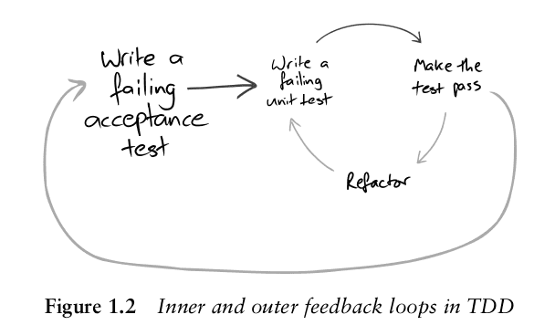

# stagentic:tdd

A planned Claude plugin for language-agnostic test-driven development.

## Overview

`stagentic:tdd` will be a Claude plugin that brings test-driven development to software projects. It is part of the [Stagentic](https://github.com/stagentic) ecosystem.

## The two loops

stagentic:tdd's initial focus is the well-known Red-Green-Refactor loop of Test-Driven Development (TDD).

Out of scope for now is TDD's lesser-known outer loop — one many practitioners missed in the original literature and rediscovered the hard way.

The **outer loop** defines new behaviour as an executable scenario, observes it fail, then evolves the guidance — skills, prompts, and checkpoints — until it passes reliably. What accumulates is not just working code but a suite of living specifications that catch regressions whenever something changes.

The **inner loop** is the familiar Red-Green-Refactor loop: write a failing test, make it pass with the minimum code change, then improve the structure without changing behaviour.

*(From "Growing Object-Oriented Software, Guided by Tests" by Nat Pryce and Steve Freeman)*

The initial focus is the inner loop, guiding an AI agent through a Red-Green-Refactor loop one behavioural increment at a time. Specifying and validating the skill itself via the outer loop is planned.

## Language adapters

Language support will be provided through adapters — the skill itself is language-agnostic. Adapters will provide build and test commands, with linters and bespoke tool-chain integration.

## Development

This plugin is being developed using [TDAB](https://substack.com/@antonymarcano/note/c-252213610) — Test-Driven Agentic Behaviours, a technique adapted from TDD and BDD to drive agent behaviour rather than code. Each behaviour is specified as a scenario, validated end-to-end before the guidance is considered done.

## License

See [LICENSE](LICENSE).
